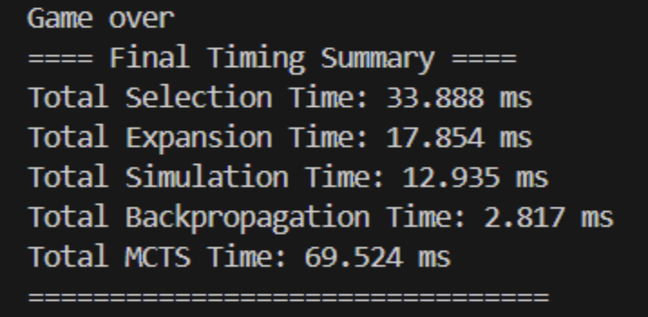
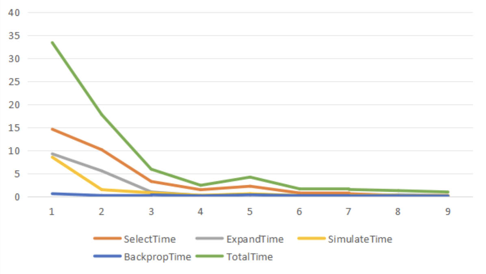
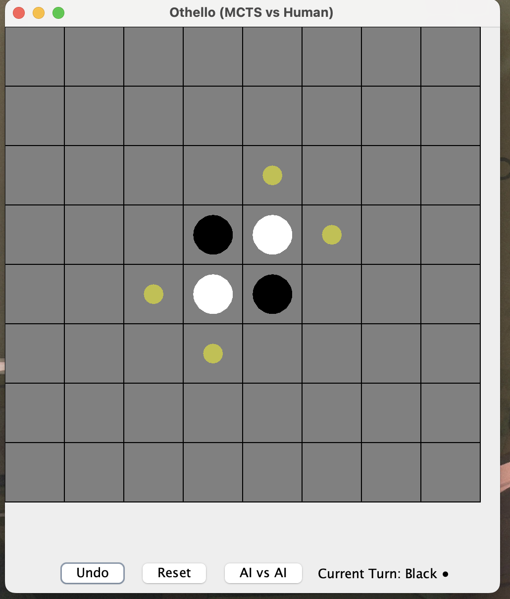
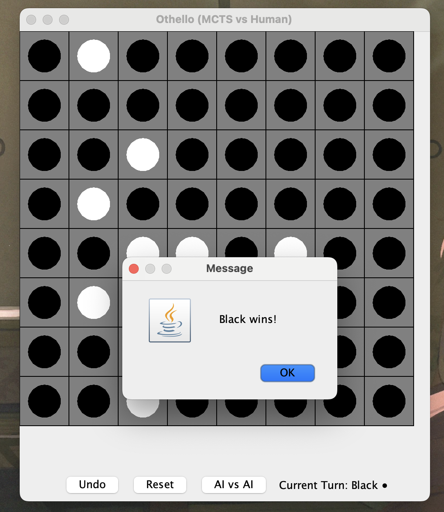
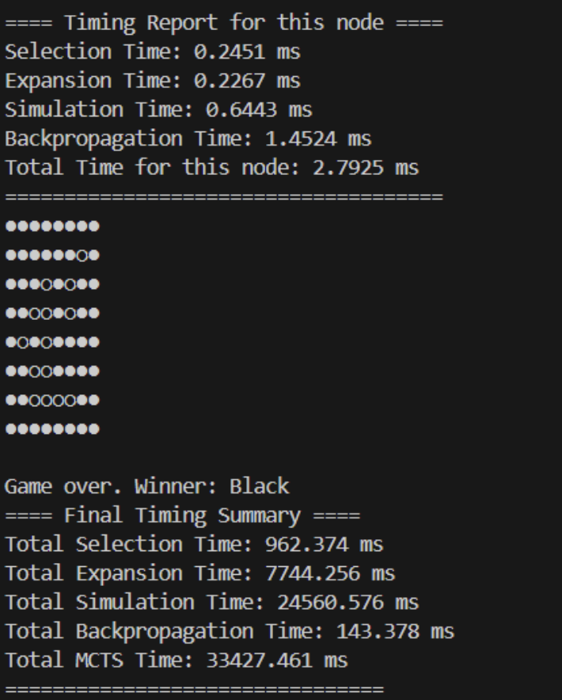
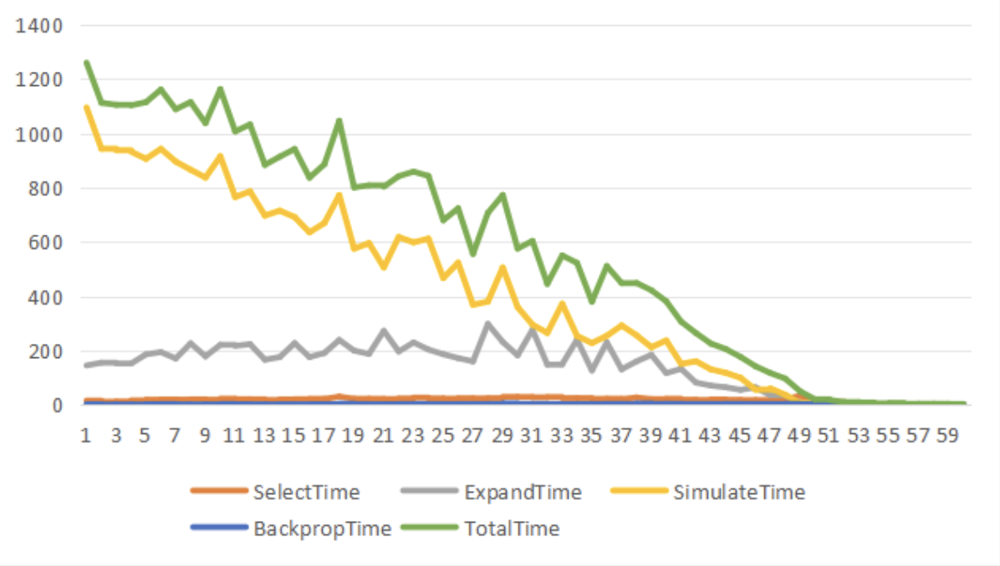

# Team 4 MCTS Report

Our project is a maven project

## MCTS

We made the following key improvements to the MCTS algorithm:

1. Changed the data type of the `wins` variable from integer to double to support a more complex scoring system for wins and losses.

2. For backpropagation, we chose to use the parent node (parentNode) instead of the default `backPropagate` function.

3. Added a new function `double reward()` in State.java to allow different states to have different reward values. This enables us to customize a more precise scoring system for complex games like Othello, rather than just having binary win/loss outcomes.


## TicTacToe

### MCTS

#### select

1. Starting Point

   The selection begins at the root node of the tree, which represents the current game state.

2. Tree Traversal 

   The algorithm traverses down the tree by selecting child nodes according to a selection policy until it reaches a leaf node or a node with unexplored children.

3. Prioritizing Unexplored Paths

   The selection algorithm first checks if the current node has any children that have never been visited (playouts = 0). If such children exist, one of these is immediately selected to ensure all options are eventually explored.

4. Balancing Exploration and Exploitation

   When all children have been visited at least once, the selection policy (typically using the UCT formula) guides the algorithm to choose the most promising node, balancing between exploring new possibilities and exploiting known promising paths.

5. Terminal Condition

   The selection process stops when it reaches either:
      - A leaf node (representing a terminal game state)
      - A node that has children in the game tree but not all possible children have been added to the search tree


#### expand

1. Node Evaluation: 

   First, the algorithm checks if the selected node is a leaf node (representing a terminal game state). If it is, no expansion is possible, and the node is returned as is.

2. Child Node Generation

   If the selected node has no children yet (i.e., it's an unexplored non-terminal node), the algorithm generates all possible child nodes representing all legal moves from the current game state.

3. Child Selection
   
   After generating all possible children, the algorithm randomly selects one of these newly created child nodes to proceed with the simulation phase. This random selection ensures diversity in the exploration process.

4. Tree Growth

   By adding these new nodes to the tree, the algorithm gradually expands the search space, allowing for more informed decision-making in future iterations.


#### simulate

1. Initialize the simulation state:

   Obtain the board state (simState) corresponding to the current node. Record the player number (currentPlayer) of the current action for determining the win-loss relationship.

2. Playout whole game 

   ```java
   while (!simState.isTerminal()) {
      Move<TicTacToe> move = simState.chooseMove(simState.player());
      simState = simState.next(move);
      invert = !invert;
   }
   ```

   Repeat until the game ends (isTerminal()). The current player selects a legal random action, chooseMove(). Perform this action to obtain a new state. Alternating players (invert was previously used to handle the determination logic of "who caused this final result", although it has actually been annotated here).

3. Evaluate the final score (Reward)

   - If no one wins (a draw) : Return 1.
   - If someone wins:
   - If the initial currentPlayer wins: Return 0 (the reward is small, indicating that the current move led to failure).
   - Otherwise (currentPlayer loses) : Return 2 (the larger reward).

#### backpropgate

   `backPropagate(Node<TicTacToe> node, int reward):`

   This function is used to propagate the simulation result (reward) upwards and update the simulation times and victory times of all nodes along the entire path. In this way, future decisions can be based on more accurate historical data.

   ```java
   while (node != null) {
      if (node instanceof TicTacToeNode ticNode) {
         ticNode.incrementPlayouts();    // Total number of games played +1
         ticNode.addWins(reward);        // Cumulative victory score（reward）
         reward = 2 - reward;            // Reward value reversal（Switch back from the opponent's perspective）
         node = ticNode.getParent();     // Propagate upwards to the parent node
      } else {
         throw new RuntimeException("Node is not a TicTacToeNode");
      }
   }
   ```

1. Why is reward = 2 - reward needed?

   MCTS is top-down search and bottom-up propagation.

   However, in the game, players take turns playing chess, and the perspectives of players on each level will alternate.

   By reversing the reward, the victory value can be transformed from the victory of one side to the defeat of the other side, thereby correctly updating the "win rate estimation" of each layer.

2. Why incrementPlayouts() and addWins(reward)?

   incrementPlayouts() is used to record how many times this node has been visited (simulated).

   addWins(reward) accumulates the reward value and is used to subsequently calculate the win rate (such as wins/playouts) to evaluate the superiority or inferiority of this node.

### Running Time

We use System.nanoTime() to obtain the running times of the four stages.



#### operations results

| Step | SelectTime | ExpandTime | SimulateTime | BackpropTime | TotalTime |
|------|------------|------------|--------------|--------------|-----------|
| 1    | 14.627     | 9.293      | 8.568        | 0.663        | 33.386    |
| 2    | 10.184     | 5.605      | 1.528        | 0.276        | 17.787    |
| 3    | 3.315      | 1.046      | 0.871        | 0.418        | 5.972     |
| 4    | 1.521      | 0.297      | 0.298        | 0.192        | 2.481     |
| 5    | 2.283      | 0.534      | 0.643        | 0.422        | 4.254     |
| 6    | 0.814      | 0.209      | 0.252        | 0.249        | 1.711     |
| 7    | 0.654      | 0.214      | 0.294        | 0.213        | 1.575     |
| 8    | 0.3        | 0.436      | 0.239        | 0.188        | 1.327     |
| 9    | 0.19       | 0.221      | 0.244        | 0.196        | 1.031     |



Here are some observations and related consumption

- The time for step 1 is significantly higher

   SelectTime (selection) and ExpandTime (expansion) are particularly time-consuming in the first step, approximately 14ms and 9ms respectively, which might be due to the first initialization or the deeper nodes in the tree.

   The SimulateTime is also relatively high (8.5ms), which is in line with expectations.

- Rapid downward trend

   Starting from step 2, the time consumption of each stage decreases rapidly and tends to be stable.

   The total time of the subsequent steps drops to the range of 1 to 5ms, and the system performance enters a steady state.

- Backpropagation always has a very small overhead:

   It remains almost at 0.2-0.4ms in all steps, with extremely low overhead and almost negligible.

### Conclusion

In our practical tests, we found that if playouts are used as the criterion for selecting the next move, MCTS does not choose the center as the first move. Although this may seem counterintuitive at first, in the case of Tic-Tac-Toe, if both players play optimally, the game will always end in a draw—so the choice of the first move doesn't actually matter. However, if we use win rate as the selection criterion, MCTS tends to choose the center as the first move.

## Othello

Othello rules for wikipedia: https://en.wikipedia.org/wiki/Reversi

We choose otheloo instead of reversi, because it is a much cooler name.

### java file explanation

1. NextStep.java

   The `NextStep.java` file defines a crucial data structure for the Othello game implementation. This class represents a potential move that a player can make during their turn.

2. PositionState.java

   ```java
   public enum PositionState {
      BLACK_WIN,
      WHITE_WIN,
      DRAW,
      IN_PEOGRESS,
   }
   ```

   The `PositionState` enum serves to classify the current state of an Othello game, providing a clear way to determine if the game has ended and, if so, who the winner is. This is crucial for both the game logic and the MCTS algorithm implementation.

3. other files

   the purporses of other files are same as those of tictactoe

### Othello Analysis

In implementing the Monte Carlo Tree Search algorithm for Othello, we encountered several challenges and made improvements:

#### Initial Attempts and Challenges

Initially, we attempted to apply the same MCTS logic used for TicTacToe to the Othello game. However, we quickly discovered that this simple adaptation resulted in an AI with poor playing skills. Through deep analysis using DFS, we found that Othello has an enormous number of possible board states, far exceeding TicTacToe. This meant that purely random simulations had little practical value in such a large state space and couldn't effectively explore valuable game paths.

#### Game Characteristic Analysis

We observed that Othello games typically conclude within 27-31 moves, indicating that despite the large state space, the game depth is not particularly high. Based on this observation, we decided to run each simulation in the MCTS simulation phase until the game's conclusion, rather than simulating only a fixed number of moves. This approach allowed us to obtain more accurate endgame evaluations, leading to more effective decision-making.

#### Improvement Strategies

To enhance MCTS performance in Othello, we implemented the following improvements:

1. **Complete Game Simulation**: Each simulation runs until the game reaches its conclusion, providing a definitive win/loss result

2. **Heuristic Evaluation Function**: When selecting nodes for expansion, we incorporate position weights, prioritizing corners and edge positions

3. **Dynamic Exploration Parameter Adjustment**: We adjust the exploration constant in the UCT formula based on the progression of the game

4. **Position Value Matrix**: We implemented a position value matrix to evaluate board positions when a simulation reaches its conclusion. This matrix assigns different weights to different positions on the board:
   - Corners are assigned the highest values as they cannot be flipped once captured
   - Edge positions have higher values than center positions
   - Positions adjacent to corners are assigned negative values as they can give the opponent access to corners

   The value matrix is used during the backpropagation phase to provide a more nuanced evaluation than simple win/loss outcomes. This helps the algorithm make better decisions by considering the strategic value of different board positions, especially in the early and middle game phases where the final outcome is still uncertain.

These improvements enabled our MCTS algorithm to search more effectively within Othello's large state space, resulting in stronger game strategies.

### Othello MCTS

#### select

same logic as TicTacToe

#### expand

The Othello expansion phase differs from the standard MCTS implementation by incorporating a heuristic scoring function to prioritize strategically valuable moves, sorting possible moves based on position values, and always selecting the highest-rated move for simulation, rather than using the purely random selection approach found in traditional MCTS.

#### simulate

The simulate method is used to perform a playout, starting from a given node, randomly or nearly randomly playing the game until the end, and returning the reward value of the simulation result. Here, we will focus on the differences from TicTacToe.

Obtain all the legal actions of the current player.
```java
ArrayList<Move<Othello>> moves = new ArrayList<>(state.moves(state.player()));
```


If there is no action to take, suspend the simulation.

Prematurely ending without a legal action (representing one party skipping. Othello is different from TicTactToe. When one party has no place to play, the other party can play twice or more in a row. Therefore, we need to make additional judgments on this situation.)


Action selection Strategy (Heuristic Scoring Top-K)
```java
int topK = Math.min(3, moves.size());
PriorityQueue<Move<Othello>> heap = new PriorityQueue<>(topK, ...);
```
Construct the maximum heap and select the top-K actions with high scores from all the actions. The score is given by getMoveScore(), which is based on the positional weights matrix (POSITION_WEIGHTS[x][y]) on the chessboard.


Select one from the Top-K actions for execution.

```java
Move<Othello> selected = topMoves.get(state.random().nextInt(topMoves.size()));
state = state.next(selected);
```

Finally calculate the reward value
```java
Optional<Integer> winner = state.winner();
if (winner.isEmpty()) return 1.0;
return winner.get() == currentPlayer ? state.reward() : 2.0 - state.reward();
```
In case of a draw, return the neutral reward 1.0
If the current player wins, return reward() (such as 1.0)
If the current player fails, return 2.0 - reward() (such as 0.0)


The role of the weight matrix POSITION_WEIGHTS

```java
public static final int[][] POSITION_WEIGHTS = {
        { 100, -25,  10,   5,   5,  10, -25, 100 },
        { -25, -50,  -2,  -2,  -2,  -2, -50, -25 },
        {  10,  -2,   5,   1,   1,   5,  -2,  10 },
        {   5,  -2,   1,   0,   0,   1,  -2,   5 },
        {   5,  -2,   1,   0,   0,   1,  -2,   5 },
        {  10,  -2,   5,   1,   1,   5,  -2,  10 },
        { -25, -50,  -2,  -2,  -2,  -2, -50, -25 },
        { 100, -25,  10,   5,   5,  10, -25, 100 }
    };
```

During the simulation process, generate all possible moves from the current state.

For each valid placement point (x, y), obtain the heuristic score of that point based on POSITION_WEIGHTS[x][y].

Actions with high scores are considered more valuable and are given priority for simulation (Top-K screening).

Objective: To guide the simulation of MCTS to focus more on areas with high strategy value, such as:

Corner (100) : Almost impossible to recapture, of extremely high value.

The sides of the corners (-25 to -50) : They are very easy to be eaten in the opposite direction and have extremely low value.

Central area (0-10) : Neutral or controllable area.


#### backpropgate

The backPropagate(`Node<Othello>` node, double reward) method is used to perform the backpropagation stage of MCTS, which is similar to the backPropagate of TicTacToe. It propagates the reward value obtained through simulation upwards along the path from the simulation termination node to the root node, updating the number of visits and the victory value of each node.

### Othello GUI

run `main()` in OthelloGUI.java for Othello GUI.

1. Chessboard rendering and piece display

Draw black pieces (●), white pieces (○) and empty Spaces in real time according to the game status.

The legal placement positions are indicated by semi-transparent yellow circles.

2. Human-machine chess
The user clicks on the chessboard to place the pieces:

The GUI automatically identifies the click position and determines whether it is a legal operation.

If it is legal, the system will automatically execute the player's move and call the AI response.

After each move, the chessboard refreshes immediately and updates the player whose turn it is.

3. AI vs. AI
After the user clicks the "AI vs AI" button, the system automatically controls the AI of both sides to take turns making moves until the end of the game.

There is a 300-millisecond delay between each move, simulating the rhythm of a real game.

Suitable for performance testing and automatic demonstration scenarios.

4. Undo function
By clicking the "Undo" button, users can undo the previous operation.

The internal state stack is used to store historical states and supports multiple consecutive revocation.

5. Reset the game
Users can immediately restart a new round of the game by clicking the "Reset" button.

The chessboard status, round information and historical records have all been cleared.

6. Game endgame detection and result display
When the final game is detected, a dialog box will pop up automatically to prompt:

The black side wins/the white side wins/draws.

Visual result feedback is carried out using the JOptionPane component.

7. Status bar information prompt
The current player's turn (black side/white side) is displayed in real time at the bottom of the interface.

The status bar is updated dynamically according to the game progress without user intervention.





### Othello Running Time

We use System.currentTimeMillis() to obtain the running times of the four stages.



#### operations result

| Step | SelectTime | ExpandTime | SimulateTime | BackpropTime | TotalTime |
|------|------------|------------|--------------|--------------|-----------|
| 1    | 15.738     | 145.202    | 1094.965     | 2.89         | 1259.794  |
| 2    | 11.577     | 155.32     | 943.01       | 1.632        | 1112.094  |
| 3    | 12.523     | 152.516    | 937.521      | 1.67         | 1104.768  |
| 4    | 16.533     | 152.142    | 932.177      | 1.615        | 1102.962  |
| 5    | 19.086     | 186.074    | 905.929      | 2.616        | 1114.447  |
| 6    | 19.897     | 194.198    | 942.685      | 3.225        | 1160.935  |
| 7    | 19.454     | 170.849    | 895.724      | 2.075        | 1088.499  |
| 8    | 20.413     | 226.577    | 865.805      | 1.798        | 1114.86   |
| 9    | 19.09      | 178.816    | 837.087      | 1.914        | 1037.168  |
| 10   | 22.874     | 221.08     | 914.892      | 3.382        | 1162.548  |



Here are some observations and related consumption

- Simulation is the most time-consuming stage, averaging 417ms, accounting for more than 70%.

- The second longest Expansion takes an average of 130 milliseconds.

- Backpropagation is almost negligible.

- Some steps take extremely little time (close to zero), which might be due to boundary states or when the game is approaching the end.

- The overall fluctuation is relatively large, and the variance of TotalTime is relatively high (std ≈ 393ms), indicating that the complexity of the tree in some steps has increased sharply.

### Conclusion

Despite our use of heuristic functions, the actual effect is still poor because Othello is a game with significant variability. Even if you have secured a good position, it may belong to your opponent in the next move or at the end of the game. Additionally, the POSITION_WEIGHTS are only designed based on our experience. Although we are learning RL in hopes of making our model smarter, due to time constraints, this can only be pursued as a subsequent personal project. Nevertheless, continuously discovering problems, thinking about them, and solving them has been a valuable experience.

During our testing, we encountered memory issues when the simulation count was set too high. This is a common challenge in MCTS implementations, especially for games with high branching factors like Othello. If we had more time, we would implement the following optimizations:

#### Selective Expansion

Instead of expanding all possible moves, we could implement a selective expansion strategy that only expands the most promising nodes. This approach would:

1. Calculate a heuristic score for each potential move
2. Sort moves based on their scores
3. Only expand the top N moves (e.g., top 5 or 10)


## Reference

## Unit Tests

This part explain targets of each unit test

#### mcts.test.java.edu.info6205.tictactoe.TicTacToeNodeTest

- **winsAndPlayouts**: Test for incrementPlayouts and addWins methods, verifying that wins and playouts are initialized to 0 and can be properly incremented
- **state**: Test for the constructor of TicTacToeNode, ensuring it correctly stores the game state
- **white**: Test for the white() method, confirming it returns the expected boolean value
- **children**: Test for the children() method, checking that a new node starts with 0 children
- **expandAll**: Test for the expandAll() method, verifying it generates all 9 possible moves for an empty TicTacToe board


#### mcts.test.java.edu.info6205.tictactoe.PositionTest

- **Move tests**: Multiple tests (testMove_2, testMove_1, testMove0, testMove1) to verify that moves are only permitted in valid empty cells and that illegal moves throw exceptions
- **Game state tests**: Tests for winner detection (testWinner0, testWinner1, testWinner2), victory condition checking (testThreeInARow), and board state verification (testFull)
- **Grid projection tests**: Tests for methods that analyze rows, columns, and diagonals (testProjectRow, testProjectCol, testProjectDiag)
- **Parsing and rendering**: Tests for cell parsing (testParseCell) and grid rendering (testRender, testToString)
- **Game mechanics**: Tests for identifying legal moves (testMoves)

#### mcts.test.java.edu.info6205.tictactoe.TicTacToeTest

- **runGame**: to test whether program can reproduce the same result with same seed

#### mcts.test.java.edu.info6205.tictactoe.MCTSTest

- **testTerminal**: Verifies the correct identification of terminal states in TicTacToe games
- **testMCTS**: Tests the complete MCTS algorithm flow and verifies the correct reduction of empty spaces after each move
- **testDraw**: Confirms that when both players use MCTS optimally, TicTacToe games consistently end in draws
- **testBenchmark**: Tests the performance measurement functionality for TicTacToe MCTS

#### mcts.test.java.edu.info6205.othello.OthelloMCTSTest

- **testTerminal**: Verifies the correct identification of terminal states in Othello games
- **testOthelloMCTS**: Tests the complete MCTS algorithm flow for Othello from initial state to game termination
- **testBenchmark**: Tests the performance measurement functionality for Othello MCTS including time metrics for each phase

#### mcts.test.java.edu.info6205.othello.OthelloNodeTest

- **winsAndPlayouts**: Tests win counter and playout counter incrementation, and leaf node identification
- **state**: Verifies that nodes correctly store and access their game state
- **white**: Tests player identification functionality
- **children**: Confirms that new nodes start with empty children collections
- **expandAll**: Tests that node expansion generates the correct number of child nodes for a given position

#### mcts.test.java.edu.info6205.othello.OthelloPositionTest

- **Win state tests**: Two tests (testBlackWin1, testBlackWin2) verifying the correct identification of winning states
- **In-progress state tests**: Tests (testInProgress1, testInProgress2) to verify correct identification of ongoing games
- **Move generation**: Tests the move functionality and verifies piece counts after moves are executed

#### mcts.test.java.edu.info6205.othello.OthelloStateTest

- **Board representation**: Tests the showBoard method to verify correct string representation of game boards
- **Reward calculation**: Tests the reward() method for different game states
- **Legal move generation**: Tests the moves() method to verify correct identification of legal moves
- **State transition**: Tests the next() method for both legal and illegal moves

#### mcts.test.java.edu.info6205.othello.OthelloTest

- **runGame**: Tests whether the game logic can successfully run a complete game from start to finish
